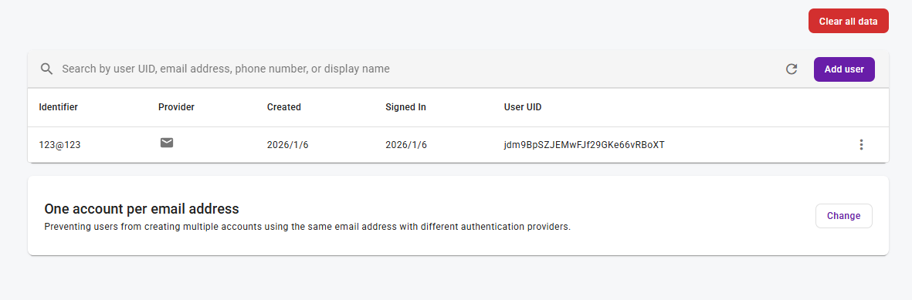

# 匿名登入與轉正式帳號（Flutter）

## 範圍說明
- 本文件涵蓋 Firebase Authentication 的匿名登入與帳號連結流程。
- 匿名登入讓使用者先以臨時帳號進入，之後可連結成正式帳號。

## 語言/版本
- Flutter (Dart)
- Firebase Auth SDK (FlutterFire)
- Firebase CLI
- FlutterFire CLI

## 實驗 2.1：匿名登入
### 目的
- 以匿名方式登入並取得使用者資訊。

### 前置需求
- 已在 `flutter_app/` 建立 Flutter 專案並完成 `flutterfire configure`。
- 若使用真實專案：需在 Firebase Console 啟用 Anonymous Sign-in Method。
- 若使用 Emulator，請先完成「Emulators 初始化選擇」。

### Emulators 初始化選擇（只做登入/Auth）
1. 只做登入/Auth，採本機 Emulator：
```bash
firebase init emulators
```
2. 依提示選擇專案：
   - `Use an existing project`
   - `Create a new project`
   - `Add Firebase to an existing Google Cloud Platform project`
   - `Don't set up a default project`
3. 進入 Emulators Setup 後，勾選 **Authentication Emulator**（視需求可加 Firestore/Functions）。
4. 參考互動輸出（範例）：
```
=== Emulators Setup
✔ Which Firebase emulators do you want to set up? Press Space to select emulators, then Enter to confirm your choices.
  • Authentication Emulator
✔ Which port do you want to use for the auth emulator? 9099
✔ Would you like to enable the Emulator UI? Yes
✔ Which port do you want to use for the Emulator UI (leave empty to use any available port)? 4000
✔ Would you like to download the emulators now? Yes
i  ui: downloading ui-v1.15.0.zip...

✔  Wrote configuration info to firebase.json
✔  Wrote project information to .firebaserc

✔  Firebase initialization complete!
```

### 步驟
1. （若尚未安裝）安裝依賴：
```bash
cd ../flutter_app
flutter pub add firebase_core firebase_auth
```

2. （可選）若使用 Auth Emulator，先在 repo 根目錄啟動：
```bash
cd ..
firebase emulators:start --only auth
```

3. （可選）在 App 連線 Emulator：
```dart
FirebaseAuth.instance.useAuthEmulator('localhost', 9099);
```

4. 匿名登入（示意）：
```dart
final auth = FirebaseAuth.instance;
final userCredential = await auth.signInAnonymously();
final uid = userCredential.user?.uid;
```

### 成功判斷
- 匿名登入成功，取得 `uid`。
- 若使用 Emulator，Emulator 內能看到匿名使用者。
- 在 Emulator UI 查看（http://127.0.0.1:4000/auth）：
  

## 實驗 2.2：匿名帳號連結為正式帳號
### 目的
- 將匿名帳號連結為 Email/Password 帳號。

### 前置需求
- 已完成匿名登入。
- 若使用真實專案：需啟用 Email/Password Sign-in Method。

### 步驟
1. 建立 Email/Password 憑證並連結：
```dart
final credential = EmailAuthProvider.credential(
  email: email,
  password: password,
);
await FirebaseAuth.instance.currentUser?.linkWithCredential(credential);
```

### 成功判斷
- 連結成功後，`currentUser` 仍保持同一 `uid`。
- 重新登入時可用 Email/Password 進入。
- 在 Emulator UI 查看（http://127.0.0.1:4000/auth）：
  

## 失敗排查（選填）
- 若出現 `operation-not-allowed`，確認 Anonymous 或 Email/Password 已在 Console 啟用。
- 若連結失敗，確認匿名帳號仍為登入狀態。

## 參考連結（選填）
- Firebase Auth：<fill-link>
